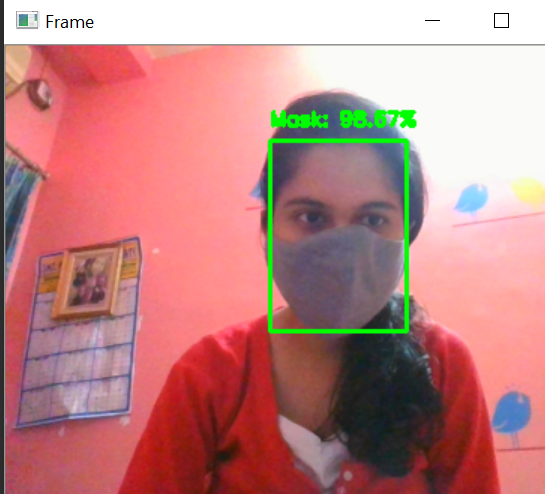
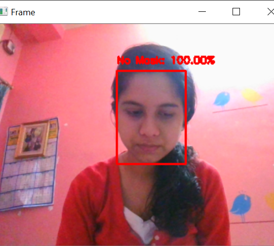

 ## 1. Face Mask Detection using neural networks, deep learning and computer vision
 ### Datasets obtained from-
 * https://www.kaggle.com/tanisha15/withmask
 * https://www.kaggle.com/tanisha15/withoutmask
### Outputs obtained~
 

